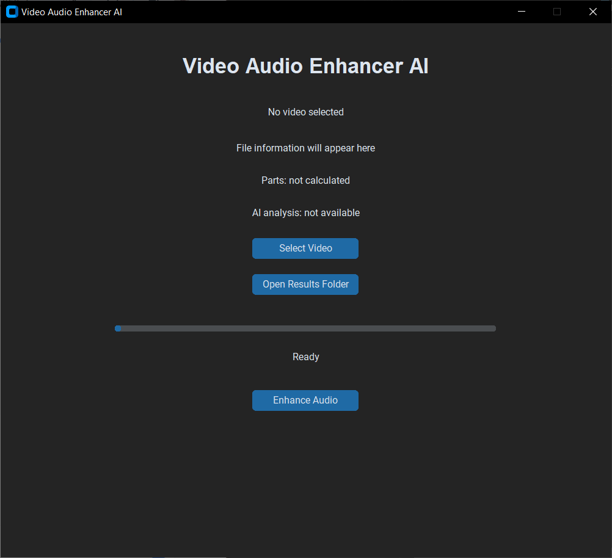
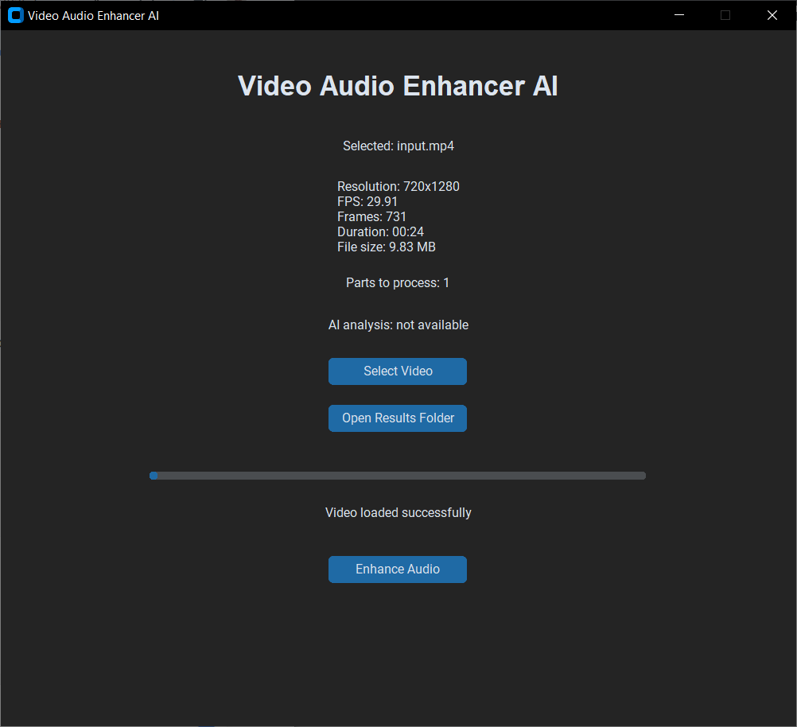
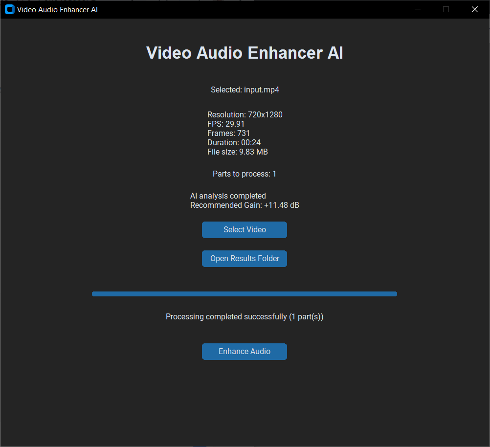

# Video Audio Enhancer AI

AI-powered desktop application for automatic audio enhancement in video files.

The application analyzes the audio track of a video, predicts an appropriate audio gain using a trained PyTorch model, enhances the audio, and combines the processed audio with the original video.

---

## Features

- AI-based audio gain analysis
- Automatic audio enhancement
- Video metadata analysis
- Audio extraction from video
- Audio analysis using signal-level and loudness metrics
- Automatic gain recommendation
- Video processing
- Automatic splitting of long videos
- Audio/video muxing
- CustomTkinter graphical user interface
- FFmpeg/FFprobe media processing
- Input file validation
- Error handling
- Unit tests
- Integration tests

---

## Processing Pipeline

```text
Input Video
    ↓
Audio Extraction
    ↓
Audio Analysis
    ↓
AI Gain Prediction
    ↓
Audio Enhancement
    ↓
Video Processing
    ↓
Video Splitting
    ↓
Audio/Video Muxing
    ↓
Output
```

## Screenshots

### Main Window



### Video Information



### Processing Completed



## Demo Video

A short demonstration of the Video Audio Enhancer AI application:

[Watch the Demo Video](demo/video-audio-enhancer-demo.mp4)

---

## Video Splitting Rules

Long videos are automatically divided into several parts according to their duration.

| Video Duration | Parts |
|---|---:|
| < 30 minutes | 1 |
| ≥ 30 minutes | 10 |
| ≥ 60 minutes | 20 |

### Boundary Cases

```text
29:59 → 1 part
30:00 → 10 parts
59:59 → 10 parts
60:00 → 20 parts
```

Short videos are processed as a single video file.

---

## Technology Stack

- Python 3.12
- CustomTkinter
- OpenCV
- FFmpeg
- FFprobe
- NumPy
- Librosa
- PyLoudNorm
- PyTorch
- Pytest

---

## Project Structure

```text
VideoAudioEnhancer/

├── app/
│   └── gui/
│
├── audio/
│   ├── analyzer.py
│   ├── enhancer.py
│   └── extractor.py
│
├── video/
│   ├── loader.py
│   ├── splitter.py
│   ├── processor.py
│   ├── output.py
│   ├── muxer.py
│   ├── audio_processor.py
│   └── ffmpeg_runner.py
│
├── core/
│   ├── exceptions.py
│   └── validators.py
│
├── models/
│
├── ai_models/
│   └── audio_gain_model.pth
│
├── tests/
│   ├── unit/
│   ├── integration/
│   └── data/
│
├── data/
│   ├── audio/
│   └── videos/
│
├── output/
│
├── main.py
├── requirements.txt
├── pytest.ini
├── .gitignore
└── README.md
```

---

## Architecture

The application follows a modular architecture.

### GUI Layer

The graphical user interface is implemented with CustomTkinter.

The GUI provides:

- video selection;
- video information display;
- video duration information;
- calculated number of processing parts;
- AI analysis status;
- processing progress;
- processing status;
- output folder access.

The main GUI entry point is the `Application` class.

### Video Layer

The video layer is responsible for:

- loading video files;
- retrieving video metadata;
- determining video duration;
- determining resolution;
- checking for an audio stream;
- validating video formats;
- splitting long videos;
- creating output directories;
- muxing processed audio with video.

### Audio Layer

The audio layer handles extraction, analysis, and enhancement.

The audio analysis stage evaluates:

- RMS;
- RMS dB;
- Peak;
- Peak dB;
- clipping;
- loudness in LUFS;
- sample rate;
- duration.

### AI Layer

The AI component uses a trained PyTorch model to predict an appropriate audio gain value.

The predicted value is expressed in decibels (dB) and is used during the audio enhancement stage.

### Core Layer

The core layer contains shared functionality such as:

- input validation;
- application exceptions;
- common error handling.

---

## AI Model

The application uses a trained PyTorch model to recommend an appropriate audio gain value in decibels.

The model is stored in:

```text
ai_models/audio_gain_model.pth
```

The AI component receives the analyzed audio data and produces a recommended gain value.

Example:

```text
Recommended Gain: +6.00 dB
```

### AI Processing Flow

```text
Input Audio
    ↓
Audio Analysis
    ↓
Feature Preparation
    ↓
PyTorch Model
    ↓
Gain Prediction
    ↓
Recommended Gain (dB)
```

The predicted gain is passed to the audio enhancement stage.

---

## Audio Analysis

The audio analysis stage evaluates several characteristics of the input audio.

### RMS

RMS (Root Mean Square) represents the average signal energy.

### RMS dB

RMS is converted into a logarithmic decibel representation.

### Peak

Peak represents the highest absolute amplitude detected in the audio signal.

### Peak dB

The peak amplitude is converted into decibels.

### Clipping

The application checks whether the signal reaches or exceeds the maximum allowed amplitude.

### Loudness

The application calculates loudness in LUFS.

### Additional Information

The analyzer also records:

- sample rate;
- duration;
- audio file path.

---

## Installation

### Requirements

The application requires:

- Python 3.12
- FFmpeg
- FFprobe
- Windows or another operating system compatible with the installed dependencies

### Create Virtual Environment

```bash
python -m venv .venv
```

Activate it on Windows:

```bash
.venv\Scripts\activate
```

### Install Dependencies

```bash
pip install -r requirements.txt
```

### Verify FFmpeg

```bash
ffmpeg -version
```

Verify FFprobe:

```bash
ffprobe -version
```

Both commands should return version information.

---

## Running the Application

### 1. Activate the Virtual Environment

```bash
.venv\Scripts\activate
```

### 2. Install Dependencies

```bash
pip install -r requirements.txt
```

### 3. Start the Application

```bash
python main.py
```

---

## Basic Workflow

1. Select an input video.
2. Review video information.
3. Start audio enhancement.
4. Extract audio.
5. Analyze audio.
6. Predict recommended gain.
7. Enhance audio.
8. Split video if required.
9. Combine video and enhanced audio.
10. Save the processed video.

---

## Output

Processed files are stored in:

```text
output/
```

A separate output directory is created for each processed input video.

Example:

```text
output/
└── example_video/
    ├── part_01.mp4
    ├── part_02.mp4
    └── ...
```

For short videos that do not require splitting, a single output file is generated.

---

## Error Handling

The application handles common processing errors, including:

- missing input files;
- invalid input files;
- corrupted video files;
- unsupported video formats;
- videos without an audio stream;
- FFmpeg processing errors;
- FFprobe errors;
- invalid video metadata;
- invalid video resolution;
- invalid video duration;
- audio processing errors;
- failed audio extraction;
- failed output generation.

---

## Testing

The project includes automated unit and integration tests implemented with Pytest.

### Unit Tests

Unit tests verify individual application components independently.

The following functionality is covered:

- video loading;
- video metadata extraction;
- video duration calculation;
- video resolution detection;
- audio analysis;
- audio gain calculation;
- audio enhancement;
- video splitting;
- output directory management;
- FFmpeg and FFprobe integration;
- input file validation;
- error handling.

Run unit tests with:

```bash
pytest tests/unit
```

### Integration Tests

Integration tests verify the interaction between multiple application components and validate the complete processing workflow.

The integration test suite covers:

1. Input video loading.
2. Audio extraction.
3. Audio analysis.
4. AI gain prediction.
5. Audio enhancement.
6. Video processing.
7. Automatic video splitting.
8. Audio/video muxing.
9. Output generation.

Additional integration scenarios include:

- short videos;
- videos with a duration of 30 minutes or more;
- videos with a duration of 60 minutes or more;
- videos without an audio stream;
- corrupted video files;
- unsupported video formats;
- very quiet audio;
- audio with a high peak level.

Run integration tests with:

```bash
pytest tests/integration
```

### Complete Test Suite

```bash
pytest
```

---

## Test Scenarios

| Scenario | Expected Result |
|---|---|
| Short video | Processed as one part |
| Video ≥ 30 minutes | Split into 10 parts |
| Video ≥ 60 minutes | Split into 20 parts |
| Video without audio | Correctly detected and handled |
| Corrupted file | Rejected with an error |
| Unsupported format | Rejected with an error |
| Very quiet audio | Correctly analyzed |
| High Peak audio | Peak/clipping information detected |
| Complete pipeline | All major components work together |

---

## Test Result

The final integration test execution completed successfully.

All implemented integration tests passed without failures.

The successful final test run confirmed that the major application components work correctly both independently and as an integrated processing pipeline.

The integration test suite also verified the application's handling of normal processing scenarios and common error conditions.

---

## Test Environment

The final testing was performed in the following environment:

```text
Operating System: Windows
Python: 3.12
Test Framework: Pytest
Media Processing: FFmpeg / FFprobe
```

---

## Dependencies

Python dependencies are listed in:

```text
requirements.txt
```

Main libraries include:

```text
customtkinter
opencv-python
numpy
librosa
pyloudnorm
torch
pytest
```

FFmpeg and FFprobe are external system dependencies and must be available through the system PATH.

---

## Project Status

The project has completed the development and testing stages.

Implemented functionality includes:

```text
✓ Video loading
✓ Video metadata analysis
✓ Audio extraction
✓ Audio analysis
✓ AI gain prediction
✓ Audio enhancement
✓ Video processing
✓ Automatic video splitting
✓ Audio/video muxing
✓ GUI
✓ Error handling
✓ Unit tests
✓ Integration tests
✓ Release preparation
```

---

## Release

### Video Audio Enhancer AI v1.0.0

The v1.0.0 release includes:

- AI audio analysis;
- automatic audio gain prediction;
- automatic audio enhancement;
- video processing;
- automatic splitting of long videos;
- audio/video muxing;
- CustomTkinter GUI;
- input validation;
- error handling;
- unit tests;
- integration tests;
- release documentation.

Release tag:

```text
v1.0.0
```

---

## Demo

A demonstration video showing the application workflow will be added to the repository as part of the release documentation.

Planned demonstration flow:

```text
Application Launch
        ↓
Video Selection
        ↓
Video Information
        ↓
AI Analysis
        ↓
Audio Enhancement
        ↓
Video Processing
        ↓
Output Generation
```

---

## Screenshots

Screenshots demonstrating the graphical user interface and processing workflow will be added to the repository.

Planned screenshots include:

- main application window;
- selected video information;
- AI analysis result;
- processing progress;
- completed processing;
- output directory.

---

## License

This project is provided for educational and demonstration purposes.
